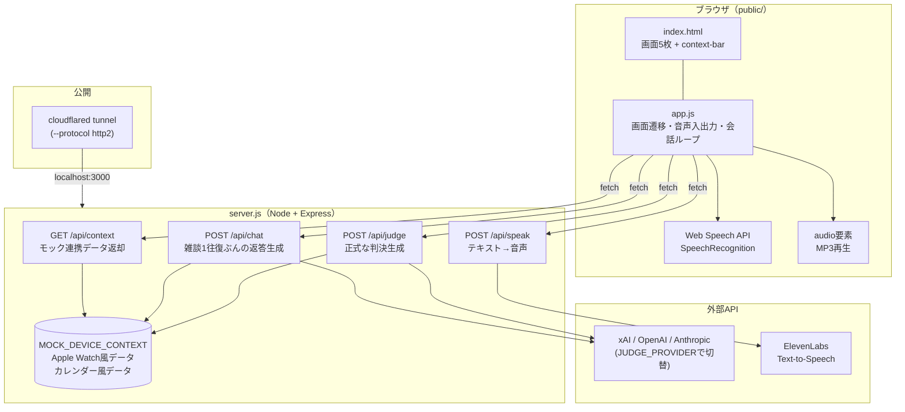
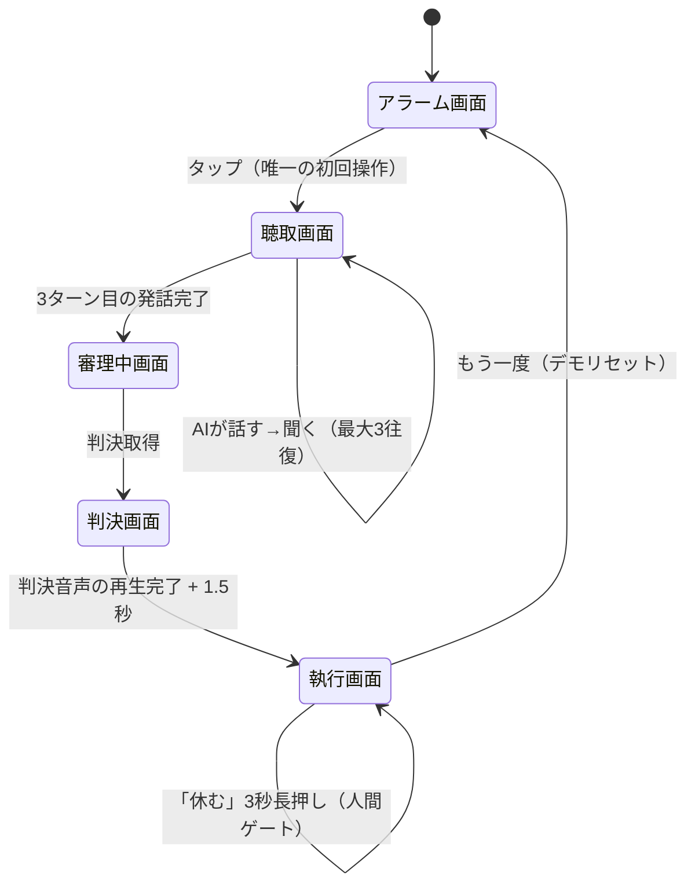
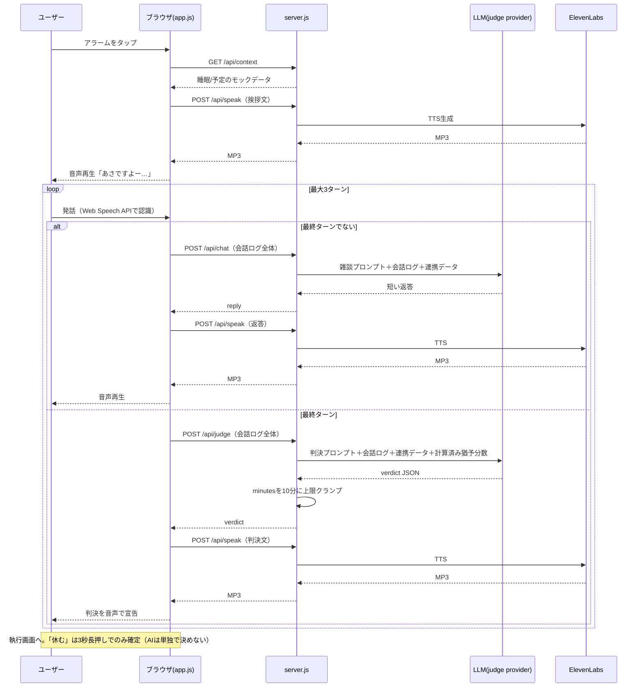

# AI二度寝裁判所 — 最終アーキテクチャ

最終的に着地した設計のまとめ。ハッカソン中の意思決定の経緯は `CURRENT_TASK.md` / `docs/design/requirements.md` を参照。このドキュメントは「今、実際に動いている仕組み」のスナップショット。

## 1. コンセプト（1分で）

朝、二度寝していいかどうかをAI裁判官に判決してもらうジョークアプリ。Apple Watchとカレンダーの情報は「すでに連携済み」という体（実際はサーバー側のダミーデータ）で、ユーザーは声で話すだけ。判決は法廷風の主文で言い渡され、音声でも読み上げられる。ただし「会社を休む」という人生に影響する決断だけは、AIが単独で決めず、3秒長押しという人間の明示的な操作を必須にしている。

## 2. 全体構成図

## 3. 画面遷移

## 4. 会話〜判決のシーケンス

## 5. API仕様

| エンドポイント | メソッド | 入力 | 出力 | 役割 |
|---|---|---|---|---|
| `/api/context` | GET | なし | `{ appleWatch, calendar, now }` | モック連携データを返す（画面上部のバッジ表示・判決の根拠） |
| `/api/chat` | POST | `{ transcript }`（会話ログ全体） | `{ reply }` | 判決前の雑談1往復ぶんの返答を生成（法廷口調ではない） |
| `/api/judge` | POST | `{ transcript }`（会話ログ全体） | `{ verdict, minutes, reason, verdictText }` | 正式な判決を生成。`minutes`は最大10に強制クランプ |
| `/api/speak` | POST | `{ text }` | `audio/mpeg`バイナリ | ElevenLabsでテキストを音声化 |

## 6. 主要な設計判断とその理由

- **判定は発話内容ではなく、サーバー計算の「猶予分数」で決める。**
  LLM（gpt-4o-mini等）に時刻の引き算をさせたところ、猶予が十分あっても常に「棄却」を選ぶなど信頼できなかったため、`今日最初の予定の時刻 - 通勤時間 - 身支度15分 - 現在時刻` をNode側で計算し、その数値をプロンプトに埋め込む方式に変更。LLMは「この数値を信じて判定する」だけに役割を限定した。
- **許可分数の上限は10分（`MAX_GRANT_MINUTES`）。**
  猶予分数（既定シナリオで約99分）をそのまま許可すると寝すぎて間延びするため、デモ向けに強制的に短くクランプしている。
- **`DEMO_FIRST_EVENT_TIME`で「許可」「棄却」を再現可能に。**
  既定シナリオ（予定09:30）は猶予が大きく、ほぼ確実に「許可」になる。「棄却」を見せたいときは `DEMO_FIRST_EVENT_TIME=07:20 pnpm start` で起動し直す。発話内容では棄却ルートを再現できないため、QAチェックリストにも明記。
- **Apple Watch/カレンダーは完全にモック（`MOCK_DEVICE_CONTEXT`）。**
  実連携は1時間のハッカソンではスコープ外と判断。「すでに連携済み」という前提で会話・判決に組み込むことで、実装コストをかけずに世界観を成立させている。
- **音声ファースト、最初の1タップだけ例外。**
  ブラウザの自動再生制限（ユーザー操作なしに音を鳴らせない）を満たすため、最初の「アラームを止める」タップだけは必須。それ以外は全て音声の自動再生・自動聴取で進む。
- **会話は最大3ターン、雑談用と判決用でプロンプトを分離。**
  `/api/chat`（親しみやすい雑談人格）と`/api/judge`（法廷の裁判官人格）を別のシステムプロンプトにして、判決の重みと雑談の軽さを両立。雑談側には「具体的な分数を言わない」制約を入れている（最終判決と矛盾する数字を口走らないため）。
- **無音（no-speech）への対応。**
  ユーザーが無反応の場合、AIが2回まで能動的に呼びかけ直す（`SILENCE_NUDGES`）。それでも無反応なら「反応なし」として会話を進め、デモが無限に止まらないようにしている。
- **「休む」だけは3秒長押し。**
  AIがどんな判決を出しても、欠勤の確定だけは人間の明示的な長押し操作を要求する。これがコンセプトの核（小さな決断はAI、大きな決断は人間）。
- **判決モデルは`JUDGE_PROVIDER`で環境変数切替（xai/openai/anthropic）。**
  ハッカソン中に複数のAPIキー事情（OpenAIのクレジット切れ等）が変わったため、コード変更なしで切り替えられる設計にした。
- **音声合成は`eleven_v3_conversational`。**
  当初の`eleven_multilingual_v2`は日本語が「たどたどしい」との評価。Grokにリサーチを依頼した結果、`eleven_v3`は高品質だがリアルタイム用途に非推奨、`eleven_v3_conversational`は日本語品質を保ちつつ低レイテンシ（公式値 約280ms）とわかり採用。声（Voice ID）自体は英語話者向けデフォルト（Rachel）のままで、Japanese向けボイス（Otani等）への切り替えはVoice Libraryを「My Voices」に追加する手動手順が残っている。
- **ホスティングはCloudflare Tunnel。**
  「ロリポップ！デプロイナウ」はExpress非公式サポートのため断念。`cloudflared tunnel --protocol http2`でローカルサーバーを公開（このネットワークはQUIC/UDPがブロックされておりhttp2固定が必要だった）。

## 7. 環境変数一覧（`example.env`）

| 変数 | 役割 |
|---|---|
| `JUDGE_PROVIDER` | `/api/judge`・`/api/chat`の呼び出し先（`xai`\|`openai`\|`anthropic`） |
| `XAI_API_KEY` / `XAI_JUDGE_MODEL` | xAI(Grok)利用時 |
| `OPENAI_API_KEY` / `OPENAI_JUDGE_MODEL` | OpenAI利用時 |
| `ANTHROPIC_API_KEY` / `ANTHROPIC_JUDGE_MODEL` | Anthropic利用時 |
| `ELEVENLABS_API_KEY` | TTS必須キー |
| `ELEVENLABS_VOICE_ID` | 読み上げ声（既定はRachel＝英語） |
| `ELEVENLABS_MODEL_ID` | TTSモデル（既定`eleven_v3_conversational`） |
| `DEMO_FIRST_EVENT_TIME` | デモシナリオ切替用（既定`09:30`） |
| `PORT` | サーバーポート（既定3000） |

## 8. 既知の制約・今後の宿題

- Apple Watch/カレンダーは実連携していない（完全モック）
- 「棄却」ルートは発話ではなく起動シナリオでしか再現できない
- 音声（Voice ID）は日本語ネイティブ声に未切替（Otani等を追加すれば改善余地あり）
- 自動テストはハッカソンスコープ外。動作確認は`docs/presentation/qa-checklist.md`で手動運用
- Cloudflare Quick Tunnelは再起動のたびにURLが変わる（本番運用向けではない）
